# System Architecture Analysis

## Overview

- **Project**: /home/tom/github/semcod/protos
- **Primary Language**: python
- **Languages**: python: 44, yaml: 11, md: 11, json: 8, proto: 5
- **Analysis Mode**: static
- **Total Functions**: 675
- **Total Classes**: 52
- **Modules**: 93
- **Entry Points**: 511

## Architecture by Module

### SUMD
- **Functions**: 235
- **File**: `SUMD.md`

### project.map.toon
- **Functions**: 235
- **File**: `map.toon.yaml`

### scripts.legacy_bridge.analyze_service_boundaries
- **Functions**: 37
- **Classes**: 2
- **File**: `analyze_service_boundaries.py`

### scripts.legacy_bridge.run_arch_migration_discovery
- **Functions**: 21
- **File**: `run_arch_migration_discovery.py`

### scripts.detect_migration_candidates
- **Functions**: 19
- **Classes**: 2
- **File**: `detect_migration_candidates.py`

### gateway.main
- **Functions**: 16
- **Classes**: 4
- **File**: `main.py`

### scripts.schema_registry
- **Functions**: 16
- **Classes**: 3
- **File**: `schema_registry.py`

### scripts.legacy_bridge.detect_cqrs_pattern_clusters
- **Functions**: 15
- **Classes**: 1
- **File**: `detect_cqrs_pattern_clusters.py`

### scripts.event_store
- **Functions**: 13
- **Classes**: 4
- **File**: `event_store.py`

### scripts.vector_clock
- **Functions**: 9
- **Classes**: 1
- **File**: `vector_clock.py`

### scripts.legacy_registry
- **Functions**: 8
- **Classes**: 2
- **File**: `legacy_registry.py`

### scripts.generate_incremental
- **Functions**: 8
- **File**: `generate_incremental.py`

### scripts.legacy_bridge.delegation_plan
- **Functions**: 8
- **File**: `delegation_plan.py`

### scripts.legacy_bridge.generate_migration_wave_plan
- **Functions**: 8
- **Classes**: 2
- **File**: `generate_migration_wave_plan.py`

### gateway.delegation
- **Functions**: 7
- **Classes**: 1
- **File**: `delegation.py`

### scripts.legacy_bridge.generate_delegation_plan
- **Functions**: 7
- **File**: `generate_delegation_plan.py`

### gateway.user_handler
- **Functions**: 6
- **File**: `user_handler.py`

### scratch.swop_scan_c2004
- **Functions**: 6
- **File**: `swop_scan_c2004.py`

### scripts.dual_writer
- **Functions**: 6
- **Classes**: 2
- **File**: `dual_writer.py`

### scripts.idempotency_store
- **Functions**: 5
- **Classes**: 1
- **File**: `idempotency_store.py`

## Key Entry Points

Main execution flows into the system:

### scripts.parse_proto.parse_proto
> Parse a .proto file and return a simplified AST dict.

Returns
-------
{
    "package": "user.v1",
    "imports": ["google/protobuf/timestamp.proto"],
- **Calls**: _PACKAGE_RE.match, _IMPORT_RE.match, _MESSAGE_START_RE.match, _ENUM_START_RE.match, stack.pop, scripts.parse_proto._to_dict, open, fh.readlines

### scratch.swop_scan_c2004.main
- **Calls**: scratch.swop_scan_c2004.collect_ground_truth, print, print, scratch.swop_scan_c2004.run_swop_scan, print, print, print, set

### scripts.legacy_registry.main
- **Calls**: argparse.ArgumentParser, parser.add_subparsers, sub.add_parser, reg_json.add_argument, reg_json.add_argument, reg_json.add_argument, reg_json.add_argument, sub.add_parser

### scratch.swop_pipeline_service_id.main
- **Calls**: Path, out_root.exists, manifests_dir.mkdir, proto_dir.mkdir, SwopConfig, print, scan_project, print

### scripts.legacy_bridge.generate_migration_wave_plan.main
- **Calls**: scripts.legacy_bridge.generate_migration_wave_plan.parse_args, None.resolve, scripts.legacy_bridge.generate_migration_wave_plan.resolve_path, scripts.legacy_bridge.generate_migration_wave_plan.resolve_path, scripts.legacy_bridge.generate_migration_wave_plan.load_json, scripts.legacy_bridge.generate_migration_wave_plan.load_json, scripts.legacy_bridge.generate_migration_wave_plan.build_waves, scripts.legacy_bridge.generate_migration_wave_plan.resolve_path

### scripts.schema_registry._cli
- **Calls**: argparse.ArgumentParser, parser.add_subparsers, sub.add_parser, reg_p.add_argument, reg_p.add_argument, reg_p.add_argument, sub.add_parser, chk_p.add_argument

### scripts.legacy_bridge.detect_cqrs_pattern_clusters.main
- **Calls**: scripts.legacy_bridge.detect_cqrs_pattern_clusters.parse_args, None.resolve, scripts.legacy_bridge.detect_cqrs_pattern_clusters.analyze_repository, Path, output_dir.mkdir, out_json.write_text, out_md.write_text, print

### scripts.legacy_bridge.generate_delegation_plan.main
- **Calls**: scripts.legacy_bridge.generate_delegation_plan.parse_args, None.resolve, None.resolve, scripts.legacy_bridge.generate_delegation_plan.load_clusters, rows.sort, max, out_dir.mkdir, out_json.write_text

### scripts.generate_incremental.main
- **Calls**: scripts.generate_incremental.load_cache, None.splitlines, os.path.exists, ln.strip, print, scripts.generate_incremental.should_regenerate, scripts.generate_incremental.save_cache, print

### scripts.legacy_bridge.analyze_service_boundaries.main
- **Calls**: scripts.legacy_bridge.analyze_service_boundaries.parse_args, None.resolve, scripts.legacy_bridge.analyze_service_boundaries.analyze, Path, output_dir.mkdir, out_json.write_text, out_md.write_text, print

### scripts.legacy_bridge.run_arch_migration_discovery.main
- **Calls**: scripts.legacy_bridge.run_arch_migration_discovery.parse_args, None.resolve, scripts.legacy_bridge.run_arch_migration_discovery.resolve_output_dir, print, print, print, print, print

### scripts.schema_registry.SchemaRegistry.register
> Register a new schema version for the package declared in *proto_path*.

Parameters
----------
proto_path:
    Path to the ``.proto`` file to register
- **Calls**: SUMD.parse_proto, scripts.schema_registry._sha256_file, self._next_version, time.time, SchemaVersion, open, fh.read, self.get_compatibility

### scripts.detect_migration_candidates.main
- **Calls**: scripts.detect_migration_candidates.parse_args, None.resolve, scripts.detect_migration_candidates.analyze_repository, None.resolve, output_path.parent.mkdir, output_path.write_text, print, print

### scripts.conflict_resolver.ConflictResolver.resolve_merge
> Field-level merge of concurrent event streams.

Rules
-----
1. Mutually-exclusive event type pairs (e.g. UserDeactivated +
   UserActivated) → ``Unres
- **Calls**: sorted, list, UnresolvableConflictError, scripts.conflict_resolver._field_effects, UnresolvableConflictError, list, list, conflicts.append

### scripts.dual_writer.DualWriter.execute_create_user
> Dual-write: EventStore + LegacyDB.
Uses command_id for idempotency.
- **Calls**: self.idem_store.is_processed, self.event_store.append, self.idem_store.mark_processed, log.info, self.idem_store.get_response, payload.get, str, self.legacy_db.upsert_user

### scripts.legacy_bridge.sync_check.main
- **Calls**: LegacySchemaRegistry, reg.get_latest, reg.get_latest, scripts.legacy_bridge.normalizer.normalize_json_schema, scripts.legacy_bridge.normalizer.normalize_proto_ast, scripts.legacy_bridge.diff_engine.diff_fields, print, print

### scripts.generate_json_schema.main
- **Calls**: SUMD.parse_proto, scripts.generate_json_schema.generate, os.makedirs, print, os.path.dirname, open, json.dump, fh.write

### scripts.search_index.SearchIndex.search
- **Calls**: params.append, self.conn.execute, where_clauses.append, params.append, where_clauses.append, params.append, dict, None.join

### scripts.generate_sql.main
- **Calls**: SUMD.parse_proto, scripts.generate_sql.generate_sql, os.makedirs, print, os.path.dirname, open, fh.write, len

### scripts.generate_pydantic.main
- **Calls**: SUMD.parse_proto, scripts.generate_pydantic.generate, os.makedirs, print, os.path.dirname, open, fh.write, len

### scripts.generate_zod.main
- **Calls**: SUMD.parse_proto, scripts.generate_zod.to_zod, os.makedirs, print, os.path.dirname, open, fh.write, len

### gateway.delegation.DelegatedSlice.detail
- **Calls**: self.health, list, list, list, list, list, list, list

### scripts.legacy_registry.LegacySchemaRegistry.register
- **Calls**: json.dumps, None.hexdigest, self._get_next_version, time.time, LegacySchemaVersion, self.conn.execute, hashlib.sha256, schema_json.encode

### scripts.vector_clock.VectorClock.happened_before
> Return ``True`` if *self* causally happened before *other*.

*self* happened-before *other* iff every entry in *self* is ≤ the
corresponding entry in 
- **Calls**: all, any, set, set, self.clocks.get, other.clocks.get, self.clocks.get, other.clocks.get

### scripts.event_store.EventStore.append
> Append an event to the stream for *aggregate_id*.

Parameters
----------
aggregate_id:
    Identifier of the aggregate (e.g. user UUID).
event_type:
 
- **Calls**: StoredEvent, self._current_version, str, time.time, self._conn.execute, ValueError, uuid.uuid4, json.dumps

### scripts.event_store.ReplayEngine.replay
> Replay events for *aggregate_id* and return the final state.

If a snapshot exists it is used as the starting point and only
events newer than the sna
- **Calls**: self.event_store.load_snapshot, self.event_store.get_stream, dict, dict, self.handlers.get, handler, self.event_store.save_snapshot

### scripts.legacy_bridge.migrator.main
- **Calls**: os.getenv, os.getenv, log.info, LegacyDB, EventStore, scripts.legacy_bridge.migrator.migrate_users, log.info

### adapters.proto_to_legacy.user_adapter.proto_to_legacy
> Map proto fields back to legacy fields.
- **Calls**: proto_dict.get, proto_dict.get, proto_dict.get, proto_dict.get, proto_dict.get, proto_dict.get, proto_dict.get

### gateway.ws.ConnectionManager.broadcast
> Send a JSON message to every connected client.

Clients that fail to receive the message are silently removed.
- **Calls**: json.dumps, list, ws.send_text, log.warning, dead.append, self._active.remove

### scripts.vector_clock.VectorClock.merge
> Return the element-wise maximum of *self* and *other*.
- **Calls**: VectorClock, set, set, max, self.clocks.get, other.clocks.get

## Process Flows

Key execution flows identified:

### Flow 1: parse_proto
```
parse_proto [scripts.parse_proto]
```

### Flow 2: main
```
main [scratch.swop_scan_c2004]
  └─> collect_ground_truth
      └─> _base_names
      └─> _kind_by_suffix
  └─> run_swop_scan
```

### Flow 3: _cli
```
_cli [scripts.schema_registry]
```

### Flow 4: register
```
register [scripts.schema_registry.SchemaRegistry]
  └─ →> parse_proto
  └─ →> _sha256_file
```

### Flow 5: resolve_merge
```
resolve_merge [scripts.conflict_resolver.ConflictResolver]
  └─ →> _field_effects
```

### Flow 6: execute_create_user
```
execute_create_user [scripts.dual_writer.DualWriter]
```

### Flow 7: search
```
search [scripts.search_index.SearchIndex]
```

## Key Classes

### scripts.schema_registry.SchemaRegistry
> SQLite-backed proto schema registry with compatibility enforcement.
- **Methods**: 10
- **Key Methods**: scripts.schema_registry.SchemaRegistry.__init__, scripts.schema_registry.SchemaRegistry.set_compatibility, scripts.schema_registry.SchemaRegistry.get_compatibility, scripts.schema_registry.SchemaRegistry.register, scripts.schema_registry.SchemaRegistry.get_latest, scripts.schema_registry.SchemaRegistry.get_by_version, scripts.schema_registry.SchemaRegistry.list_schemas, scripts.schema_registry.SchemaRegistry._next_version, scripts.schema_registry.SchemaRegistry._all_versions, scripts.schema_registry.SchemaRegistry._row_to_sv

### scripts.vector_clock.VectorClock
> Immutable vector clock.

Attributes
----------
clocks:
    Mapping of node/client identifier → logic
- **Methods**: 9
- **Key Methods**: scripts.vector_clock.VectorClock.increment, scripts.vector_clock.VectorClock.merge, scripts.vector_clock.VectorClock.happened_before, scripts.vector_clock.VectorClock.concurrent_with, scripts.vector_clock.VectorClock.dominates, scripts.vector_clock.VectorClock.to_dict, scripts.vector_clock.VectorClock.from_dict, scripts.vector_clock.VectorClock.__eq__, scripts.vector_clock.VectorClock.__repr__

### scripts.event_store.EventStore
> Append-only event store backed by SQLite.
- **Methods**: 9
- **Key Methods**: scripts.event_store.EventStore.__init__, scripts.event_store.EventStore.append, scripts.event_store.EventStore.get_stream, scripts.event_store.EventStore.iter_all, scripts.event_store.EventStore.save_snapshot, scripts.event_store.EventStore.load_snapshot, scripts.event_store.EventStore.merge_streams, scripts.event_store.EventStore._current_version, scripts.event_store.EventStore._row_to_event

### scripts.legacy_registry.LegacySchemaRegistry
- **Methods**: 7
- **Key Methods**: scripts.legacy_registry.LegacySchemaRegistry.__init__, scripts.legacy_registry.LegacySchemaRegistry._init_db, scripts.legacy_registry.LegacySchemaRegistry.register, scripts.legacy_registry.LegacySchemaRegistry._get_next_version, scripts.legacy_registry.LegacySchemaRegistry.get_latest, scripts.legacy_registry.LegacySchemaRegistry._row_to_sv, scripts.legacy_registry.LegacySchemaRegistry.list_schemas

### scripts.idempotency_store.IdempotencyStore
- **Methods**: 5
- **Key Methods**: scripts.idempotency_store.IdempotencyStore.__init__, scripts.idempotency_store.IdempotencyStore._init_db, scripts.idempotency_store.IdempotencyStore.is_processed, scripts.idempotency_store.IdempotencyStore.mark_processed, scripts.idempotency_store.IdempotencyStore.get_response

### gateway.ws.ConnectionManager
> Thread-safe (asyncio-safe) WebSocket broadcast pool.
- **Methods**: 4
- **Key Methods**: gateway.ws.ConnectionManager.__init__, gateway.ws.ConnectionManager.connect, gateway.ws.ConnectionManager.disconnect, gateway.ws.ConnectionManager.broadcast

### gateway.delegation.DelegatedSlice
- **Methods**: 4
- **Key Methods**: gateway.delegation.DelegatedSlice._path_checks, gateway.delegation.DelegatedSlice.health, gateway.delegation.DelegatedSlice.summary, gateway.delegation.DelegatedSlice.detail

### scripts.search_index.SearchIndex
- **Methods**: 4
- **Key Methods**: scripts.search_index.SearchIndex.__init__, scripts.search_index.SearchIndex._init_db, scripts.search_index.SearchIndex.upsert_entry, scripts.search_index.SearchIndex.search

### scripts.dual_writer.LegacyDB
> Simulated legacy database.
- **Methods**: 4
- **Key Methods**: scripts.dual_writer.LegacyDB.__init__, scripts.dual_writer.LegacyDB._init_db, scripts.dual_writer.LegacyDB.upsert_user, scripts.dual_writer.LegacyDB.get_all_users

### scripts.conflict_resolver.ConflictResolver
> Resolves conflicts between concurrent event streams.

Parameters
----------
field_effect_map:
    Ma
- **Methods**: 3
- **Key Methods**: scripts.conflict_resolver.ConflictResolver.__post_init__, scripts.conflict_resolver.ConflictResolver.resolve_lww, scripts.conflict_resolver.ConflictResolver.resolve_merge

### scripts.dual_writer.DualWriter
- **Methods**: 2
- **Key Methods**: scripts.dual_writer.DualWriter.__init__, scripts.dual_writer.DualWriter.execute_create_user

### scripts.event_store.ReplayEngine
> Rebuild aggregate state by replaying events from the event store.

Parameters
----------
event_store
- **Methods**: 2
- **Key Methods**: scripts.event_store.ReplayEngine.register, scripts.event_store.ReplayEngine.replay

### scripts.schema_registry.IncompatibleSchemaError
> Raised when a proposed schema change violates the active compatibility mode.
- **Methods**: 1
- **Key Methods**: scripts.schema_registry.IncompatibleSchemaError.__init__
- **Inherits**: Exception

### scripts.conflict_resolver.UnresolvableConflictError
> Raised when two concurrent events cannot be automatically merged.
- **Methods**: 1
- **Key Methods**: scripts.conflict_resolver.UnresolvableConflictError.__init__
- **Inherits**: Exception

### generated.python.user_v1_models.CreateUserCommand
- **Methods**: 0
- **Inherits**: BaseModel

### generated.python.user_v1_models.GetUserQuery
- **Methods**: 0
- **Inherits**: BaseModel

### generated.python.user_v1_models.User
- **Methods**: 0
- **Inherits**: BaseModel

### gateway.main.CreateUserRequest
- **Methods**: 0
- **Inherits**: BaseModel

### gateway.main.DualCreateUserRequest
- **Methods**: 0
- **Inherits**: CreateUserRequest

### gateway.main.IndexEntryRequest
- **Methods**: 0
- **Inherits**: BaseModel

## Data Transformation Functions

Key functions that process and transform data:

### scripts.idempotency_store.IdempotencyStore.is_processed
- **Output to**: None.fetchone, self.conn.execute

### scripts.idempotency_store.IdempotencyStore.mark_processed
- **Output to**: self.conn.execute, time.time

### scripts.detect_migration_candidates.parse_args
- **Output to**: argparse.ArgumentParser, parser.add_argument, parser.add_argument, parser.add_argument, parser.add_argument

### scripts.legacy_bridge.generate_delegation_plan.parse_score
- **Output to**: float, row.get

### scripts.legacy_bridge.generate_delegation_plan.parse_args
- **Output to**: argparse.ArgumentParser, parser.add_argument, parser.add_argument, parser.add_argument, parser.add_argument

### scripts.legacy_bridge.detect_cqrs_pattern_clusters.parse_args
- **Output to**: argparse.ArgumentParser, parser.add_argument, parser.add_argument, parser.add_argument, parser.add_argument

### scripts.legacy_bridge.analyze_service_boundaries.parse_args
- **Output to**: argparse.ArgumentParser, parser.add_argument, parser.add_argument, parser.add_argument, parser.add_argument

### scripts.legacy_bridge.analyze_service_boundaries.parse_ts_import_specs
- **Output to**: TS_IMPORT_RE.finditer, match.group, match.group, specs.append

### scripts.legacy_bridge.analyze_service_boundaries.parse_router_prefixes
- **Output to**: ast.walk, isinstance, isinstance, scripts.legacy_bridge.analyze_service_boundaries.const_str, prefixes.append

### scripts.legacy_bridge.analyze_service_boundaries.parse_python_imports
- **Output to**: set, ast.walk, isinstance, isinstance, imports.add

### scripts.legacy_bridge.generate_migration_wave_plan.parse_args
- **Output to**: argparse.ArgumentParser, parser.add_argument, parser.add_argument, parser.add_argument, parser.add_argument

### SUMD.parse_args

### SUMD.parse_ts_import_specs

### SUMD.parse_router_prefixes

### SUMD.parse_python_imports

### SUMD.parse_score

### SUMD._parse_score

### SUMD._parse_reserved_numbers

### SUMD.parse_proto

### SUMD.test_different_formats_independent

### project.map.toon.parse_args

### project.map.toon.parse_ts_import_specs

### project.map.toon.parse_router_prefixes

### project.map.toon.parse_python_imports

### project.map.toon.parse_score

## Behavioral Patterns

### recursion_deep_merge
- **Type**: recursion
- **Confidence**: 0.90
- **Functions**: scripts.legacy_bridge.detect_cqrs_pattern_clusters.deep_merge

### recursion_deep_merge
- **Type**: recursion
- **Confidence**: 0.90
- **Functions**: scripts.legacy_bridge.analyze_service_boundaries.deep_merge

### recursion__to_dict
- **Type**: recursion
- **Confidence**: 0.90
- **Functions**: scripts.parse_proto._to_dict

### state_machine_ConnectionManager
- **Type**: state_machine
- **Confidence**: 0.70
- **Functions**: gateway.ws.ConnectionManager.__init__, gateway.ws.ConnectionManager.connect, gateway.ws.ConnectionManager.disconnect, gateway.ws.ConnectionManager.broadcast

## Public API Surface

Functions exposed as public API (no underscore prefix):

- `scripts.legacy_bridge.analyze_service_boundaries.analyze_frontend_modules` - 66 calls
- `scripts.legacy_bridge.run_arch_migration_discovery.run_discovery` - 57 calls
- `scripts.parse_proto.parse_proto` - 55 calls
- `scratch.swop_scan_c2004.main` - 53 calls
- `scripts.legacy_registry.main` - 52 calls
- `scripts.legacy_bridge.run_arch_migration_discovery.build_delegation_decision_report` - 43 calls
- `scratch.swop_pipeline_service_id.main` - 37 calls
- `scripts.legacy_bridge.detect_cqrs_pattern_clusters.analyze_repository` - 37 calls
- `scripts.legacy_bridge.run_arch_migration_discovery.render_summary_markdown` - 34 calls
- `scripts.detect_migration_candidates.discover_candidate_paths` - 33 calls
- `scripts.legacy_bridge.delegation_plan.render_markdown` - 33 calls
- `scripts.legacy_bridge.generate_migration_wave_plan.main` - 33 calls
- `scripts.legacy_bridge.run_arch_migration_discovery.get_candidate_exclusion_reasons` - 33 calls
- `scripts.legacy_bridge.run_arch_migration_discovery.profile_repository` - 33 calls
- `scripts.detect_migration_candidates.analyze_candidate` - 32 calls
- `scripts.legacy_bridge.analyze_service_boundaries.build_service_components` - 32 calls
- `scripts.legacy_bridge.detect_cqrs_pattern_clusters.main` - 31 calls
- `scripts.legacy_bridge.generate_migration_wave_plan.build_waves` - 31 calls
- `scripts.legacy_bridge.analyze_service_boundaries.build_ts_index` - 30 calls
- `scripts.legacy_bridge.generate_delegation_plan.main` - 29 calls
- `scripts.legacy_bridge.analyze_service_boundaries.build_markdown` - 26 calls
- `scripts.generate_incremental.main` - 24 calls
- `scripts.legacy_bridge.generate_delegation_plan.is_delegable_candidate` - 24 calls
- `scripts.legacy_bridge.analyze_service_boundaries.main` - 24 calls
- `scripts.legacy_bridge.run_arch_migration_discovery.build_summary` - 24 calls
- `scripts.legacy_bridge.run_arch_migration_discovery.main` - 24 calls
- `scripts.legacy_bridge.delegation_plan.build_output_row` - 22 calls
- `scripts.legacy_bridge.detect_cqrs_pattern_clusters.classify_pattern` - 21 calls
- `scripts.legacy_bridge.generate_migration_wave_plan.render_markdown` - 21 calls
- `scripts.legacy_bridge.run_arch_migration_discovery.render_delegation_decisions_markdown` - 21 calls
- `scripts.legacy_bridge.run_arch_migration_discovery.render_excluded_candidates_markdown` - 20 calls
- `scripts.legacy_bridge.diff_engine.diff_fields` - 19 calls
- `scripts.legacy_bridge.analyze_service_boundaries.build_backend_index` - 19 calls
- `scripts.schema_registry.SchemaRegistry.register` - 18 calls
- `scripts.legacy_bridge.run_arch_migration_discovery.build_excluded_candidates_report` - 18 calls
- `scripts.detect_migration_candidates.main` - 17 calls
- `scripts.legacy_bridge.analyze_service_boundaries.resolve_candidate_file` - 16 calls
- `scripts.generate_pydantic.generate` - 16 calls
- `scripts.conflict_resolver.ConflictResolver.resolve_merge` - 15 calls
- `scripts.generate_zod.to_zod` - 15 calls

## System Interactions

How components interact:

```mermaid
graph TD
    parse_proto --> match
    parse_proto --> pop
    main --> collect_ground_truth
    main --> print
    main --> run_swop_scan
    main --> ArgumentParser
    main --> add_subparsers
    main --> add_parser
    main --> add_argument
    main --> Path
    main --> exists
    main --> mkdir
    main --> SwopConfig
    main --> parse_args
    main --> resolve
    main --> resolve_path
    main --> load_json
    _cli --> ArgumentParser
    _cli --> add_subparsers
    _cli --> add_parser
    _cli --> add_argument
    main --> analyze_repository
    main --> load_clusters
    main --> sort
    main --> load_cache
    main --> splitlines
    main --> strip
    main --> analyze
    main --> resolve_output_dir
    register --> parse_proto
```



## Reverse Engineering Guidelines

1. **Entry Points**: Start analysis from the entry points listed above
2. **Core Logic**: Focus on classes with many methods
3. **Data Flow**: Follow data transformation functions
4. **Process Flows**: Use the flow diagrams for execution paths
5. **API Surface**: Public API functions reveal the interface

## Context for LLM

Maintain the identified architectural patterns and public API surface when suggesting changes.