# System Architecture Analysis

## Overview

- **Project**: /home/tom/github/semcod/protos
- **Primary Language**: python
- **Languages**: python: 58, md: 16, yaml: 11, json: 11, typescript: 5
- **Analysis Mode**: static
- **Total Functions**: 1120
- **Total Classes**: 60
- **Modules**: 117
- **Entry Points**: 861

## Architecture by Module

### project.map.toon
- **Functions**: 398
- **File**: `map.toon.yaml`

### SUMD
- **Functions**: 398
- **File**: `SUMD.md`

### scripts.legacy_bridge.analyze_service_boundaries
- **Functions**: 63
- **Classes**: 2
- **File**: `analyze_service_boundaries.py`

### protogate.cli
- **Functions**: 27
- **File**: `cli.py`

### scripts.detect_migration_candidates
- **Functions**: 21
- **Classes**: 2
- **File**: `detect_migration_candidates.py`

### scripts.legacy_bridge.run_arch_migration_discovery
- **Functions**: 19
- **File**: `run_arch_migration_discovery.py`

### gateway.main
- **Functions**: 16
- **Classes**: 4
- **File**: `main.py`

### scripts.schema_registry
- **Functions**: 16
- **Classes**: 3
- **File**: `schema_registry.py`

### scripts.legacy_bridge.detect_cqrs_pattern_clusters
- **Functions**: 15
- **Classes**: 1
- **File**: `detect_cqrs_pattern_clusters.py`

### protogate.codegen.typescript
- **Functions**: 13
- **Classes**: 1
- **File**: `typescript.py`

### scripts.event_store
- **Functions**: 13
- **Classes**: 4
- **File**: `event_store.py`

### scripts.legacy_bridge.swop_integration
- **Functions**: 12
- **File**: `swop_integration.py`

### protogate.codegen.pydantic_cross_check
- **Functions**: 12
- **Classes**: 1
- **File**: `pydantic_cross_check.py`

### scripts.legacy_bridge.detect_shared_ts_packages
- **Functions**: 10
- **Classes**: 1
- **File**: `detect_shared_ts_packages.py`

### scripts.parse_proto
- **Functions**: 9
- **Classes**: 4
- **File**: `parse_proto.py`

### scripts.vector_clock
- **Functions**: 9
- **Classes**: 1
- **File**: `vector_clock.py`

### scripts.legacy_bridge.report_rendering
- **Functions**: 9
- **File**: `report_rendering.py`

### scripts.legacy_registry
- **Functions**: 8
- **Classes**: 2
- **File**: `legacy_registry.py`

### scripts.generate_incremental
- **Functions**: 8
- **File**: `generate_incremental.py`

### scripts.legacy_bridge.delegation_plan
- **Functions**: 8
- **File**: `delegation_plan.py`

## Key Entry Points

Main execution flows into the system:

### protogate.cli.main
- **Calls**: argparse.ArgumentParser, parser.add_subparsers, subparsers.add_parser, gen_parser.add_argument, gen_parser.set_defaults, subparsers.add_parser, reg_parser.add_argument, reg_parser.add_argument

### scratch.swop_scan_c2004.main
- **Calls**: scratch.swop_scan_c2004.collect_ground_truth, print, print, scratch.swop_scan_c2004.run_swop_scan, print, print, print, set

### scripts.legacy_registry.main
- **Calls**: argparse.ArgumentParser, parser.add_subparsers, sub.add_parser, reg_json.add_argument, reg_json.add_argument, reg_json.add_argument, reg_json.add_argument, sub.add_parser

### scratch.swop_pipeline_service_id.main
- **Calls**: Path, out_root.exists, manifests_dir.mkdir, proto_dir.mkdir, SwopConfig, print, scan_project, print

### protogate.codegen.jsonschema_zod.run_cli
- **Calls**: input_dir.resolve, output_dir.mkdir, sorted, sorted, index_lines.append, None.write_text, print, print

### scripts.legacy_bridge.generate_migration_wave_plan.main
- **Calls**: scripts.legacy_bridge.generate_migration_wave_plan.parse_args, None.resolve, scripts.legacy_bridge.generate_migration_wave_plan.resolve_path, scripts.legacy_bridge.generate_migration_wave_plan.resolve_path, scripts.legacy_bridge.generate_migration_wave_plan.load_json, scripts.legacy_bridge.generate_migration_wave_plan.load_json, scripts.legacy_bridge.generate_migration_wave_plan.build_waves, scripts.legacy_bridge.generate_migration_wave_plan.resolve_path

### protogate.codegen.registry.run_cli
> CLI entry point used by ``protogate codegen registry``.

Returns 0 on success, 1 on validation failure.

When *cross_check_pydantic* is ``True`` every
- **Calls**: output_dir.mkdir, registry_json_path.write_text, registry_md_path.write_text, print, protogate.codegen.registry.build, print, print, project.map.toon.cross_check_contracts

### scripts.schema_registry._cli
- **Calls**: argparse.ArgumentParser, parser.add_subparsers, sub.add_parser, reg_p.add_argument, reg_p.add_argument, reg_p.add_argument, sub.add_parser, chk_p.add_argument

### scripts.legacy_bridge.detect_cqrs_pattern_clusters.main
- **Calls**: scripts.legacy_bridge.detect_cqrs_pattern_clusters.parse_args, None.resolve, scripts.legacy_bridge.detect_cqrs_pattern_clusters.analyze_repository, Path, output_dir.mkdir, out_json.write_text, out_md.write_text, print

### protogate.codegen.pydantic_json_schema.run_cli
> Generate JSON Schema files for the given modules.

Parameters
----------
modules:
    Iterable of dotted module paths (e.g. ``["api.schemas.scenarios"
- **Calls**: output_dir.mkdir, sorted, sys.path.insert, print, print, models.update, print, models.items

### scripts.legacy_bridge.generate_delegation_plan.main
- **Calls**: scripts.legacy_bridge.generate_delegation_plan.parse_args, None.resolve, None.resolve, scripts.legacy_bridge.generate_delegation_plan.load_clusters, rows.sort, max, out_dir.mkdir, out_json.write_text

### scripts.legacy_bridge.run_arch_migration_discovery.main
- **Calls**: scripts.legacy_bridge.run_arch_migration_discovery.parse_args, None.resolve, scripts.legacy_bridge.run_arch_migration_discovery.resolve_output_dir, print, print, print, print, print

### scripts.generate_incremental.main
- **Calls**: scripts.generate_incremental.load_cache, None.splitlines, os.path.exists, ln.strip, print, scripts.generate_incremental.should_regenerate, scripts.generate_incremental.save_cache, print

### scripts.legacy_bridge.detect_shared_ts_packages.main
- **Calls**: scripts.legacy_bridge.detect_shared_ts_packages.parse_args, None.resolve, Path, output_dir.mkdir, out_json.write_text, out_md.write_text, print, print

### scripts.legacy_bridge.analyze_service_boundaries.main
- **Calls**: scripts.legacy_bridge.analyze_service_boundaries.parse_args, None.resolve, scripts.legacy_bridge.analyze_service_boundaries.analyze, Path, scripts.legacy_bridge.analyze_service_boundaries.write_outputs, print, print, None.resolve

### scripts.schema_registry.SchemaRegistry.register
> Register a new schema version for the package declared in *proto_path*.

Parameters
----------
proto_path:
    Path to the ``.proto`` file to register
- **Calls**: scripts.parse_proto.parse_proto, scripts.schema_registry._sha256_file, self._next_version, time.time, SchemaVersion, open, fh.read, self.get_compatibility

### scripts.detect_migration_candidates.main
- **Calls**: scripts.detect_migration_candidates.parse_args, None.resolve, scripts.detect_migration_candidates.analyze_repository, None.resolve, output_path.parent.mkdir, output_path.write_text, print, print

### protogate.cli.cmd_migration_candidates
> Run migration candidate detection and optionally emit markdown report.
- **Calls**: str, protogate.cli.run_command, Path, str, cmd.append, output_path.exists, json.loads, protogate.cli._load_module_from_path

### scripts.dual_writer.DualWriter.execute_create_user
> Dual-write: EventStore + LegacyDB.
Uses command_id for idempotency.
- **Calls**: self.idem_store.is_processed, self.event_store.append, self.idem_store.mark_processed, log.info, self.idem_store.get_response, payload.get, str, self.legacy_db.upsert_user

### scripts.legacy_bridge.sync_check.main
- **Calls**: LegacySchemaRegistry, reg.get_latest, reg.get_latest, scripts.legacy_bridge.normalizer.normalize_json_schema, scripts.legacy_bridge.normalizer.normalize_proto_ast, scripts.legacy_bridge.diff_engine.diff_fields, print, print

### protogate.cli.cmd_codegen_json_schema
> Generate JSON Schema files from Pydantic models.

Replaces ``c2004/scripts/generate_json_schemas.py`` per ADR-010 Sprint C.
- **Calls**: None.resolve, _pjs.run_cli, print, None.resolve, raw.split, Path, print, c.strip

### protogate.cli.cmd_discovery
> Run the migration discovery orchestrator.
- **Calls**: str, protogate.cli.run_command, str, cmd.extend, cmd.extend, cmd.extend, cmd.extend, cmd.extend

### protogate.cli.cmd_codegen_registry
> Generate contract registry (registry.json + REGISTRY.md) from JSON contracts.

Replaces the legacy ``c2004/scripts/generate-registry.py`` per ADR-010

- **Calls**: None.resolve, _reg.run_cli, contracts_dir.exists, print, None.resolve, None.resolve, Path, getattr

### scripts.generate_json_schema.main
- **Calls**: scripts.parse_proto.parse_proto, scripts.generate_json_schema.generate, os.makedirs, print, os.path.dirname, open, json.dump, fh.write

### scripts.conflict_resolver.ConflictResolver.resolve_merge
> Field-level merge of concurrent event streams.

Rules
-----
1. Mutually-exclusive event type pairs (e.g. UserDeactivated +
   UserActivated) → ``Unres
- **Calls**: self._check_exclusive_event_pairs, self._check_field_conflicts, sorted, UnresolvableConflictError, UnresolvableConflictError, list, list, None.join

### scripts.search_index.SearchIndex.search
- **Calls**: params.append, self.conn.execute, where_clauses.append, params.append, where_clauses.append, params.append, dict, None.join

### scripts.generate_sql.main
- **Calls**: scripts.parse_proto.parse_proto, scripts.generate_sql.generate_sql, os.makedirs, print, os.path.dirname, open, fh.write, len

### scripts.generate_pydantic.main
- **Calls**: scripts.parse_proto.parse_proto, scripts.generate_pydantic.generate, os.makedirs, print, os.path.dirname, open, fh.write, len

### scripts.generate_zod.main
- **Calls**: scripts.parse_proto.parse_proto, scripts.generate_zod.to_zod, os.makedirs, print, os.path.dirname, open, fh.write, len

### gateway.delegation.DelegatedSlice.detail
- **Calls**: self.health, list, list, list, list, list, list, list

## Process Flows

Key execution flows identified:

### Flow 1: main
```
main [protogate.cli]
```

### Flow 2: run_cli
```
run_cli [protogate.codegen.jsonschema_zod]
```

### Flow 3: _cli
```
_cli [scripts.schema_registry]
```

### Flow 4: register
```
register [scripts.schema_registry.SchemaRegistry]
  └─ →> parse_proto
      └─> _handle_message_start
      └─> _handle_enum_start
  └─ →> _sha256_file
```

### Flow 5: cmd_migration_candidates
```
cmd_migration_candidates [protogate.cli]
  └─> run_command
```

### Flow 6: execute_create_user
```
execute_create_user [scripts.dual_writer.DualWriter]
```

## Key Classes

### protogate.codegen.typescript.TypeScriptEmitter
> Fluent builder for a single generated TypeScript file.

Usage from a thin wrapper script::

    emit
- **Methods**: 10
- **Key Methods**: protogate.codegen.typescript.TypeScriptEmitter.__init__, protogate.codegen.typescript.TypeScriptEmitter.with_entity_id_base, protogate.codegen.typescript.TypeScriptEmitter.add_raw, protogate.codegen.typescript.TypeScriptEmitter.add_section, protogate.codegen.typescript.TypeScriptEmitter.add_enum, protogate.codegen.typescript.TypeScriptEmitter.add_enums, protogate.codegen.typescript.TypeScriptEmitter.add_interface, protogate.codegen.typescript.TypeScriptEmitter.add_interfaces, protogate.codegen.typescript.TypeScriptEmitter.header, protogate.codegen.typescript.TypeScriptEmitter.render

### scripts.schema_registry.SchemaRegistry
> SQLite-backed proto schema registry with compatibility enforcement.
- **Methods**: 10
- **Key Methods**: scripts.schema_registry.SchemaRegistry.__init__, scripts.schema_registry.SchemaRegistry.set_compatibility, scripts.schema_registry.SchemaRegistry.get_compatibility, scripts.schema_registry.SchemaRegistry.register, scripts.schema_registry.SchemaRegistry.get_latest, scripts.schema_registry.SchemaRegistry.get_by_version, scripts.schema_registry.SchemaRegistry.list_schemas, scripts.schema_registry.SchemaRegistry._next_version, scripts.schema_registry.SchemaRegistry._all_versions, scripts.schema_registry.SchemaRegistry._row_to_sv

### scripts.vector_clock.VectorClock
> Immutable vector clock.

Attributes
----------
clocks:
    Mapping of node/client identifier → logic
- **Methods**: 9
- **Key Methods**: scripts.vector_clock.VectorClock.increment, scripts.vector_clock.VectorClock.merge, scripts.vector_clock.VectorClock.happened_before, scripts.vector_clock.VectorClock.concurrent_with, scripts.vector_clock.VectorClock.dominates, scripts.vector_clock.VectorClock.to_dict, scripts.vector_clock.VectorClock.from_dict, scripts.vector_clock.VectorClock.__eq__, scripts.vector_clock.VectorClock.__repr__

### scripts.event_store.EventStore
> Append-only event store backed by SQLite.
- **Methods**: 9
- **Key Methods**: scripts.event_store.EventStore.__init__, scripts.event_store.EventStore.append, scripts.event_store.EventStore.get_stream, scripts.event_store.EventStore.iter_all, scripts.event_store.EventStore.save_snapshot, scripts.event_store.EventStore.load_snapshot, scripts.event_store.EventStore.merge_streams, scripts.event_store.EventStore._current_version, scripts.event_store.EventStore._row_to_event

### scripts.legacy_registry.LegacySchemaRegistry
- **Methods**: 7
- **Key Methods**: scripts.legacy_registry.LegacySchemaRegistry.__init__, scripts.legacy_registry.LegacySchemaRegistry._init_db, scripts.legacy_registry.LegacySchemaRegistry.register, scripts.legacy_registry.LegacySchemaRegistry._get_next_version, scripts.legacy_registry.LegacySchemaRegistry.get_latest, scripts.legacy_registry.LegacySchemaRegistry._row_to_sv, scripts.legacy_registry.LegacySchemaRegistry.list_schemas

### scripts.idempotency_store.IdempotencyStore
- **Methods**: 5
- **Key Methods**: scripts.idempotency_store.IdempotencyStore.__init__, scripts.idempotency_store.IdempotencyStore._init_db, scripts.idempotency_store.IdempotencyStore.is_processed, scripts.idempotency_store.IdempotencyStore.mark_processed, scripts.idempotency_store.IdempotencyStore.get_response

### scripts.conflict_resolver.ConflictResolver
> Resolves conflicts between concurrent event streams.

Parameters
----------
field_effect_map:
    Ma
- **Methods**: 5
- **Key Methods**: scripts.conflict_resolver.ConflictResolver.__post_init__, scripts.conflict_resolver.ConflictResolver.resolve_lww, scripts.conflict_resolver.ConflictResolver._check_exclusive_event_pairs, scripts.conflict_resolver.ConflictResolver._check_field_conflicts, scripts.conflict_resolver.ConflictResolver.resolve_merge

### gateway.ws.ConnectionManager
> Thread-safe (asyncio-safe) WebSocket broadcast pool.
- **Methods**: 4
- **Key Methods**: gateway.ws.ConnectionManager.__init__, gateway.ws.ConnectionManager.connect, gateway.ws.ConnectionManager.disconnect, gateway.ws.ConnectionManager.broadcast

### gateway.delegation.DelegatedSlice
- **Methods**: 4
- **Key Methods**: gateway.delegation.DelegatedSlice._path_checks, gateway.delegation.DelegatedSlice.health, gateway.delegation.DelegatedSlice.summary, gateway.delegation.DelegatedSlice.detail

### scripts.search_index.SearchIndex
- **Methods**: 4
- **Key Methods**: scripts.search_index.SearchIndex.__init__, scripts.search_index.SearchIndex._init_db, scripts.search_index.SearchIndex.upsert_entry, scripts.search_index.SearchIndex.search

### scripts.dual_writer.LegacyDB
> Simulated legacy database.
- **Methods**: 4
- **Key Methods**: scripts.dual_writer.LegacyDB.__init__, scripts.dual_writer.LegacyDB._init_db, scripts.dual_writer.LegacyDB.upsert_user, scripts.dual_writer.LegacyDB.get_all_users

### scripts.dual_writer.DualWriter
- **Methods**: 2
- **Key Methods**: scripts.dual_writer.DualWriter.__init__, scripts.dual_writer.DualWriter.execute_create_user

### scripts.event_store.ReplayEngine
> Rebuild aggregate state by replaying events from the event store.

Parameters
----------
event_store
- **Methods**: 2
- **Key Methods**: scripts.event_store.ReplayEngine.register, scripts.event_store.ReplayEngine.replay

### scripts.schema_registry.IncompatibleSchemaError
> Raised when a proposed schema change violates the active compatibility mode.
- **Methods**: 1
- **Key Methods**: scripts.schema_registry.IncompatibleSchemaError.__init__
- **Inherits**: Exception

### scripts.conflict_resolver.UnresolvableConflictError
> Raised when two concurrent events cannot be automatically merged.
- **Methods**: 1
- **Key Methods**: scripts.conflict_resolver.UnresolvableConflictError.__init__
- **Inherits**: Exception

### protogate.codegen.pydantic_cross_check.CrossCheckResult
- **Methods**: 1
- **Key Methods**: protogate.codegen.pydantic_cross_check.CrossCheckResult.format

### protogate.codegen.registry.RegistryResult
- **Methods**: 1
- **Key Methods**: protogate.codegen.registry.RegistryResult.ok

### generated.python.search_v1_models.IndexEntryCommand
- **Methods**: 0
- **Inherits**: BaseModel

### generated.python.search_v1_models.EntryIndexed
- **Methods**: 0
- **Inherits**: BaseModel

### generated.python.search_v1_models.SearchRequest
- **Methods**: 0
- **Inherits**: BaseModel

## Data Transformation Functions

Key functions that process and transform data:

### protogate.cli._load_parse_proto_function
- **Output to**: protogate.cli._load_module_from_path, getattr

### scripts.parse_proto._parse_reserved_numbers
> Parse a reserved-numbers token such as ``1, 2, 3`` or ``1 to 5``.
- **Output to**: token.split, part.strip, part.split, numbers.extend, part.isdigit

### scripts.parse_proto._parse_top_level_declarations
> Parse package and import declarations. Returns True if matched.
- **Output to**: _PACKAGE_RE.match, _IMPORT_RE.match, pkg_match.group, None.append, import_match.group

### scripts.parse_proto.parse_proto
> Parse a .proto file and return a simplified AST dict.

Returns
-------
{
    "package": "user.v1",
 
- **Output to**: scripts.parse_proto._handle_message_start, scripts.parse_proto._handle_enum_start, scripts.parse_proto._handle_block_end, stack.pop, scripts.parse_proto._to_dict

### scripts.idempotency_store.IdempotencyStore.is_processed
- **Output to**: None.fetchone, self.conn.execute

### scripts.idempotency_store.IdempotencyStore.mark_processed
- **Output to**: self.conn.execute, time.time

### scripts.detect_migration_candidates.parse_args
- **Output to**: argparse.ArgumentParser, parser.add_argument, parser.add_argument, parser.add_argument, parser.add_argument

### scripts.legacy_bridge.report_rendering._format_detail_value
- **Output to**: row.get, str, float

### scripts.legacy_bridge.swop_integration._swop_subprocess_script
- **Output to**: None.strip

### scripts.legacy_bridge.generate_delegation_plan.parse_args
- **Output to**: argparse.ArgumentParser, parser.add_argument, parser.add_argument, parser.add_argument, parser.add_argument

### scripts.legacy_bridge.run_arch_migration_discovery.parse_args
- **Output to**: argparse.ArgumentParser, parser.add_argument, parser.add_argument, parser.add_argument, parser.add_argument

### scripts.legacy_bridge.run_arch_migration_discovery._parse_score
- **Output to**: scripts.legacy_bridge.candidate_selection.parse_score

### scripts.legacy_bridge.detect_cqrs_pattern_clusters.parse_args
- **Output to**: argparse.ArgumentParser, parser.add_argument, parser.add_argument, parser.add_argument, parser.add_argument

### scripts.legacy_bridge.candidate_selection.parse_score
- **Output to**: float, row.get

### scripts.legacy_bridge.detect_shared_ts_packages.parse_args
- **Output to**: argparse.ArgumentParser, parser.add_argument, parser.add_argument, parser.add_argument, parser.add_argument

### scripts.legacy_bridge.analyze_service_boundaries.parse_args
- **Output to**: argparse.ArgumentParser, parser.add_argument, parser.add_argument, parser.add_argument, parser.add_argument

### scripts.legacy_bridge.analyze_service_boundaries.parse_ts_import_specs
- **Output to**: TS_IMPORT_RE.finditer, match.group, match.group, specs.append

### scripts.legacy_bridge.analyze_service_boundaries.parse_router_prefixes
- **Output to**: ast.walk, isinstance, isinstance, scripts.legacy_bridge.analyze_service_boundaries.const_str, prefixes.append

### scripts.legacy_bridge.analyze_service_boundaries.parse_python_imports
- **Output to**: set, ast.walk, isinstance, isinstance, imports.add

### scripts.legacy_bridge.generate_migration_wave_plan.parse_args
- **Output to**: argparse.ArgumentParser, parser.add_argument, parser.add_argument, parser.add_argument, parser.add_argument

### project.map.toon._load_parse_proto_function

### project.map.toon._parse_layer_path

### project.map.toon.validate_contract

### project.map.toon.parse_args

### project.map.toon.parse_ts_import_specs

## Behavioral Patterns

### recursion_json_schema_to_zod
- **Type**: recursion
- **Confidence**: 0.90
- **Functions**: protogate.codegen.jsonschema_zod.json_schema_to_zod

### recursion__collect_refs
- **Type**: recursion
- **Confidence**: 0.90
- **Functions**: protogate.codegen.jsonschema_zod._collect_refs

### recursion_python_type_to_typescript
- **Type**: recursion
- **Confidence**: 0.90
- **Functions**: protogate.codegen.typescript.python_type_to_typescript

### recursion__to_dict
- **Type**: recursion
- **Confidence**: 0.90
- **Functions**: scripts.parse_proto._to_dict

### recursion_deep_merge
- **Type**: recursion
- **Confidence**: 0.90
- **Functions**: scripts.legacy_bridge.detect_cqrs_pattern_clusters.deep_merge

### recursion_deep_merge
- **Type**: recursion
- **Confidence**: 0.90
- **Functions**: scripts.legacy_bridge.analyze_service_boundaries.deep_merge

### recursion__node_name
- **Type**: recursion
- **Confidence**: 0.90
- **Functions**: protogate.codegen.pydantic_cross_check._node_name

### recursion__extract_literal_values
- **Type**: recursion
- **Confidence**: 0.90
- **Functions**: protogate.codegen.pydantic_cross_check._extract_literal_values

### recursion__iter_enum_fields
- **Type**: recursion
- **Confidence**: 0.90
- **Functions**: protogate.codegen.pydantic_cross_check._iter_enum_fields

### state_machine_ConnectionManager
- **Type**: state_machine
- **Confidence**: 0.70
- **Functions**: gateway.ws.ConnectionManager.__init__, gateway.ws.ConnectionManager.connect, gateway.ws.ConnectionManager.disconnect, gateway.ws.ConnectionManager.broadcast

## Public API Surface

Functions exposed as public API (no underscore prefix):

- `protogate.cli.main` - 102 calls
- `protogate.codegen.registry.generate_registry_markdown` - 90 calls
- `scripts.legacy_bridge.run_arch_migration_discovery.run_discovery` - 78 calls
- `scratch.swop_scan_c2004.main` - 53 calls
- `scripts.legacy_registry.main` - 52 calls
- `scripts.legacy_bridge.detect_shared_ts_packages.analyze` - 46 calls
- `scripts.legacy_bridge.run_arch_migration_discovery.build_service_boundary_decision_report` - 45 calls
- `scripts.legacy_bridge.run_arch_migration_discovery.build_delegation_decision_report` - 43 calls
- `scratch.swop_pipeline_service_id.main` - 37 calls
- `scripts.legacy_bridge.detect_cqrs_pattern_clusters.analyze_repository` - 37 calls
- `protogate.codegen.jsonschema_zod.run_cli` - 36 calls
- `scripts.legacy_bridge.run_arch_migration_discovery.build_summary` - 34 calls
- `protogate.codegen.registry.generate_registry_json` - 34 calls
- `scripts.detect_migration_candidates.discover_candidate_paths` - 33 calls
- `scripts.legacy_bridge.delegation_plan.render_markdown` - 33 calls
- `scripts.legacy_bridge.run_arch_migration_discovery.profile_repository` - 33 calls
- `scripts.legacy_bridge.candidate_selection.get_candidate_exclusion_reasons` - 33 calls
- `scripts.legacy_bridge.generate_migration_wave_plan.main` - 33 calls
- `protogate.codegen.registry.run_cli` - 33 calls
- `protogate.codegen.jsonschema_zod.json_schema_to_zod` - 31 calls
- `scripts.legacy_bridge.detect_cqrs_pattern_clusters.main` - 31 calls
- `scripts.legacy_bridge.generate_migration_wave_plan.build_waves` - 31 calls
- `protogate.codegen.pydantic_json_schema.run_cli` - 30 calls
- `scripts.legacy_bridge.generate_delegation_plan.main` - 29 calls
- `scripts.legacy_bridge.run_arch_migration_discovery.main` - 29 calls
- `scripts.legacy_bridge.analyze_service_boundaries.build_service_blueprint_markdown` - 26 calls
- `scripts.legacy_bridge.swop_integration.run_swop_pipeline` - 25 calls
- `scripts.generate_incremental.main` - 24 calls
- `scripts.legacy_bridge.swop_integration.render_swop_markdown` - 24 calls
- `scripts.legacy_bridge.delegation_plan.build_output_row` - 22 calls
- `scripts.legacy_bridge.detect_shared_ts_packages.main` - 22 calls
- `scripts.legacy_bridge.swop_integration.infer_contexts_from_service_boundaries` - 21 calls
- `scripts.legacy_bridge.detect_cqrs_pattern_clusters.classify_pattern` - 21 calls
- `scripts.legacy_bridge.generate_migration_wave_plan.render_markdown` - 21 calls
- `scripts.legacy_bridge.report_rendering.render_summary_markdown` - 20 calls
- `scripts.legacy_bridge.analyze_service_boundaries.analyze_frontend_modules` - 20 calls
- `protogate.codegen.jsonschema_zod.schema_file_to_zod` - 19 calls
- `scripts.legacy_bridge.diff_engine.diff_fields` - 19 calls
- `scripts.legacy_bridge.analyze_service_boundaries.build_backend_index` - 19 calls
- `scripts.legacy_bridge.analyze_service_boundaries.main` - 19 calls

## System Interactions

How components interact:

```mermaid
graph TD
    main --> ArgumentParser
    main --> add_subparsers
    main --> add_parser
    main --> add_argument
    main --> set_defaults
    main --> collect_ground_truth
    main --> print
    main --> run_swop_scan
    main --> Path
    main --> exists
    main --> mkdir
    main --> SwopConfig
    run_cli --> resolve
    run_cli --> mkdir
    run_cli --> sorted
    run_cli --> append
    main --> parse_args
    main --> resolve
    main --> resolve_path
    main --> load_json
    run_cli --> write_text
    run_cli --> print
    run_cli --> build
    _cli --> ArgumentParser
    _cli --> add_subparsers
    _cli --> add_parser
    _cli --> add_argument
    main --> analyze_repository
    run_cli --> insert
    main --> load_clusters
```



## Reverse Engineering Guidelines

1. **Entry Points**: Start analysis from the entry points listed above
2. **Core Logic**: Focus on classes with many methods
3. **Data Flow**: Follow data transformation functions
4. **Process Flows**: Use the flow diagrams for execution paths
5. **API Surface**: Public API functions reveal the interface

## Context for LLM

Maintain the identified architectural patterns and public API surface when suggesting changes.